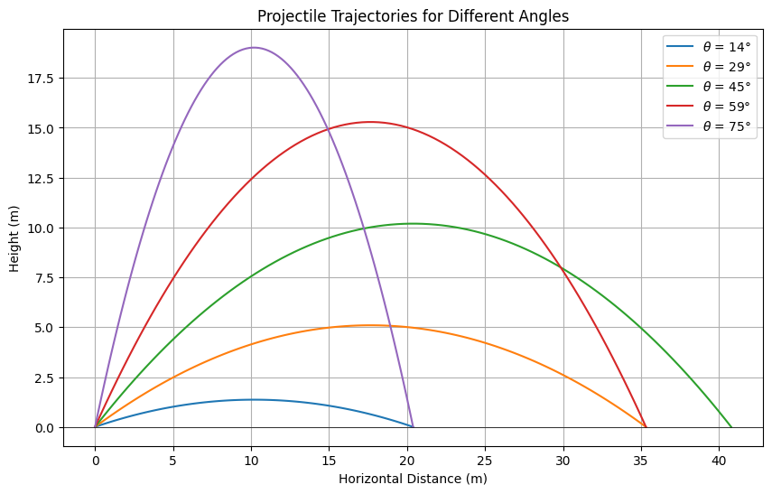
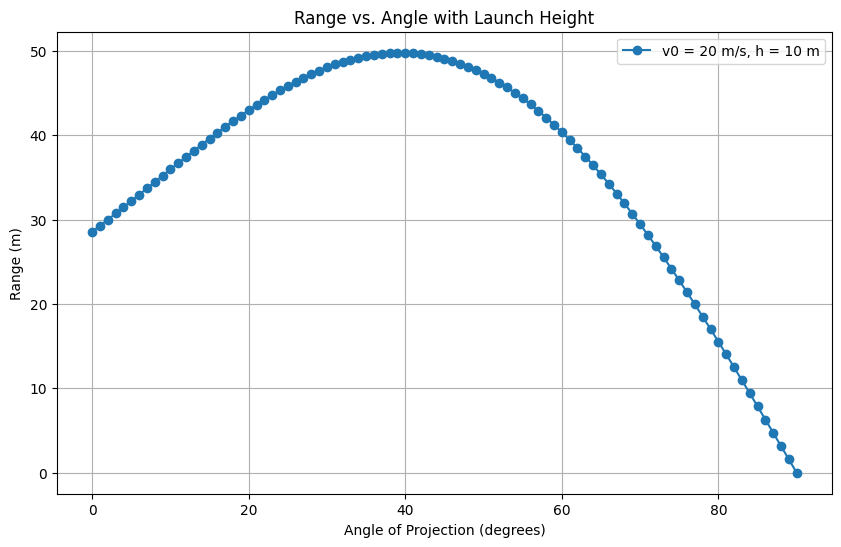
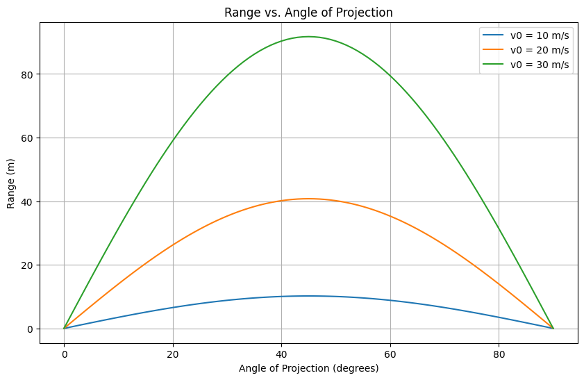

# Investigating the Range as a Function of the Angle of Projection

## 1. Theoretical Foundation

Projectile motion describes the trajectory of an object under the influence of gravity, assuming no other forces (e.g., air resistance) act upon it. Let’s derive the governing equations from first principles.

### 1.1 Deriving the Equations of Motion

The motion can be split into horizontal (x) and vertical (y) components. Assume the projectile is launched from the origin $(x_0, y_0) = (0, 0)$ with an initial velocity $v_0$ at an angle $\theta$ from the horizontal. The acceleration due to gravity is $g$, acting downward.

- **Initial velocities:**

  - Horizontal: $v_{0x} = v_0 \cos\theta$
  - Vertical: $v_{0y} = v_0 \sin\theta$

- **Accelerations:**

  - Horizontal: $a_x = 0$ (no horizontal forces)
  - Vertical: $a_y = -g$

Using Newton’s equations of motion, the position as a function of time $t$ is:

- Horizontal: $x(t) = v_{0x} t = (v_0 \cos\theta) t$
- Vertical: $y(t) = v_{0y} t + \frac{1}{2} a_y t^2 = (v_0 \sin\theta) t - \frac{1}{2} g t^2$

### 1.2 Time of Flight

The projectile returns to the ground when $y(t) = 0$:

$$
(v_0 \sin\theta) t - \frac{1}{2} g t^2 = 0
$$

Factorizing:

$$
t \left( v_0 \sin\theta - \frac{1}{2} g t \right) = 0
$$

Solutions: $t = 0$ (launch) or $t = \frac{2 v_0 \sin\theta}{g}$ (landing). Thus, the time of flight $T$ is:

$$
T = \frac{2 v_0 \sin\theta}{g}
$$

### 1.3 Range Equation

The horizontal range $R$ is the distance traveled when $t = T$:

$$
R = v_{0x} T = (v_0 \cos\theta) \cdot \frac{2 v_0 \sin\theta}{g}
$$

Using the trigonometric identity $2 \sin\theta \cos\theta = \sin 2\theta$:

$$
R = \frac{v_0^2 \sin 2\theta}{g}
$$

This is the range as a function of the angle of projection $\theta$.

### 1.4 Family of Solutions

The range depends on free parameters:

- $v_0$: Initial velocity
- $g$: Gravitational acceleration
- $\theta$: Angle of projection

Varying these parameters generates a family of solutions. For instance, increasing $v_0$ scales $R$ quadratically, while $g$ inversely affects $R$.

## 2. Analysis of the Range

### 2.1 Dependence on Angle $\theta$

The term $\sin 2\theta$ dictates the angular dependence:

- At $\theta = 0^\circ$ or $90^\circ$, $\sin 2\theta = 0$, so $R = 0$.
- Maximum range occurs when $\sin 2\theta = 1$, i.e., $2\theta = 90^\circ$, or $\theta = 45^\circ$:

$$
R_{\text{max}} = \frac{v_0^2}{g}
$$

- Complementary angles (e.g., $30^\circ$ and $60^\circ$) yield the same range since $\sin(180^\circ - 2\theta) = \sin 2\theta$.

### 2.2 Influence of Parameters

- **Initial Velocity ($v_0$)**: $R \propto v_0^2$. Doubling $v_0$ quadruples the range.
- **Gravity ($g$)**: $R \propto \frac{1}{g}$. On the Moon ($g \approx 1.62 \, \text{m/s}^2$), the range is ~6 times larger than on Earth ($g \approx 9.81 \, \text{m/s}^2$).

## 3. Practical Applications

### 3.1 Uneven Terrain

For a launch height $h$, the vertical displacement becomes:
$$
y(t) = h + (v_0 \sin\theta) t - \frac{1}{2} g t^2
$$

Set $y(t) = 0$ to find the new time of flight:

$$
\frac{1}{2} g t^2 - (v_0 \sin\theta) t - h = 0
$$

Solve the quadratic equation for $t$, then compute $R = (v_0 \cos\theta) t$.

- Max Range = 49.78 m at 39.0°

### 3.2 Air Resistance

With drag ($F_d = -k v$), the equations become nonlinear:

$$
m \frac{dv_x}{dt} = -k v_x, \quad m \frac{dv_y}{dt} = -mg - k v_y
$$

Analytical solutions are complex, so numerical methods (e.g., Euler or Runge-Kutta) are typically used.

### 3.3 Real-World Examples

- **Sports**: Optimizing a basketball shot ($\theta \approx 45^\circ$).
- **Engineering**: Artillery trajectories with wind and drag.
- **Astrophysics**: Planetary motion with adjusted $g$.

## 4. Implementation

Below is a Python script to simulate and visualize the range versus angle.

- v0 = 10 m/s, Max Range at 45° = 10.19 m
- v0 = 20 m/s, Max Range at 45° = 40.77 m
- v0 = 30 m/s, Max Range at 45° = 91.74 m