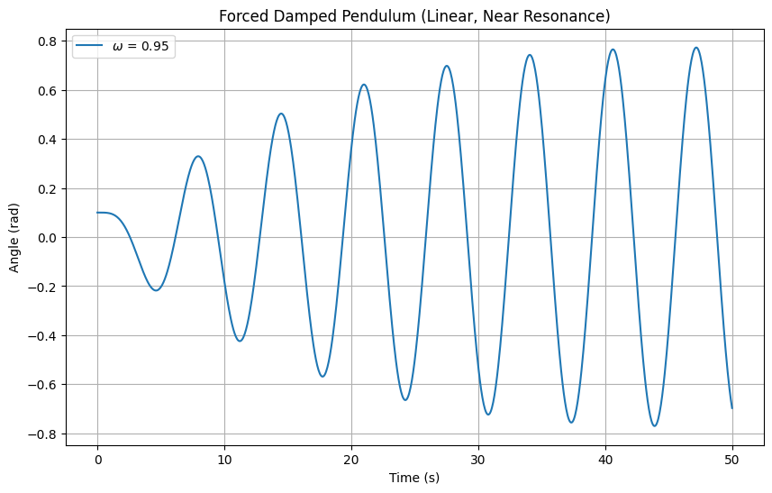
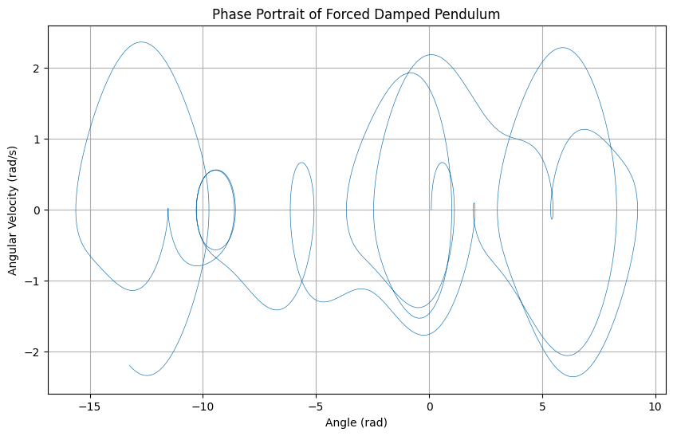
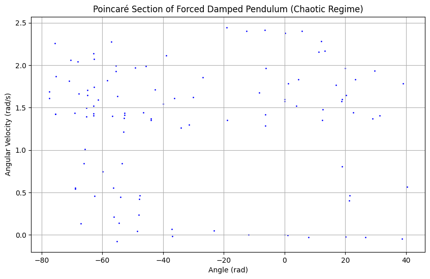

# Investigating the Dynamics of a Forced Damped Pendulum

## Motivation

The forced damped pendulum is a fascinating system that evolves from simple harmonic motion to complex dynamics due to damping and periodic external forcing. This interplay introduces phenomena like resonance, chaos, and quasiperiodic motion, offering insights into real-world systems such as mechanical oscillators, climate models, and structural engineering under periodic loads. The addition of forcing parameters—amplitude and frequency—enriches the system’s behavior, making it a powerful tool for studying both fundamental physics and practical applications.

## 1. Theoretical Foundation

### 1.1 Governing Differential Equation

The motion of a pendulum with length $l$, mass $m$, under gravitational acceleration $g$, damping coefficient $b$, and external forcing $F(t) = F_0 \cos(\omega t)$ is governed by:

$$
\frac{d^2\theta}{dt^2} + \frac{b}{m} \frac{d\theta}{dt} + \frac{g}{l} \sin\theta = \frac{F_0}{ml} \cos(\omega t)
$$

where $\theta$ is the angular displacement, $\frac{b}{m}$ is the damping rate, $\frac{g}{l}$ relates to the natural frequency, and $\frac{F_0}{ml} \cos(\omega t)$ is the driving term.

Define:

- Natural angular frequency: $\omega_0 = \sqrt{\frac{g}{l}}$
- Damping constant: $\gamma = \frac{b}{m}$
- Driving amplitude: $A = \frac{F_0}{ml}$

Thus, the equation becomes:

$$
\frac{d^2\theta}{dt^2} + \gamma \frac{d\theta}{dt} + \omega_0^2 \sin\theta = A \cos(\omega t)
$$

### 1.2 Small-Angle Approximation

For small $\theta$, $\sin\theta \approx \theta$, simplifying the equation to a linear forced damped oscillator:

$$
\frac{d^2\theta}{dt^2} + \gamma \frac{d\theta}{dt} + \omega_0^2 \theta = A \cos(\omega t)
$$

This is a second-order linear differential equation. The homogeneous solution is:

$$
\theta_h(t) = e^{-\frac{\gamma}{2} t} \left( C_1 \cos(\omega_d t) + C_2 \sin(\omega_d t) \right)
$$

where $\omega_d = \sqrt{\omega_0^2 - \left(\frac{\gamma}{2}\right)^2}$ is the damped frequency, and $C_1, C_2$ depend on initial conditions.

The particular solution for the driving term is:

$$
\theta_p(t) = B \cos(\omega t - \phi)
$$

where the amplitude $B$ and phase $\phi$ are:

$$
B = \frac{A}{\sqrt{(\omega_0^2 - \omega^2)^2 + (\gamma \omega)^2}}, \quad \tan\phi = \frac{\gamma \omega}{\omega_0^2 - \omega^2}
$$

### 1.3 Resonance

Resonance occurs when the driving frequency $\omega$ approaches the natural frequency $\omega_0$. For low damping ($\gamma \ll \omega_0$), the amplitude peaks near $\omega = \omega_0$, with maximum:

$$
B_{\text{max}} \approx \frac{A}{\gamma \omega_0}
$$

This amplification highlights energy transfer efficiency.

## 2. Analysis of Dynamics

### 2.1 Parameter Influence

- **Damping ($\gamma$)**: Low $\gamma$ sustains oscillations; high $\gamma$ causes rapid decay.
- **Driving Amplitude ($A$)**: Higher $A$ can push the system into nonlinear regimes or chaos.
- **Driving Frequency ($\omega$)**: Near $\omega_0$, resonance amplifies motion; far from $\omega_0$, motion may become quasiperiodic or chaotic.

### 2.2 Transition to Chaos

For large $A$ or specific $\omega$, the nonlinear term $\sin\theta$ dominates, leading to chaotic behavior. This is characterized by sensitivity to initial conditions and aperiodic motion, observable in phase portraits and Poincaré sections.

## 3. Practical Applications

- **Energy Harvesting**: Pendulum-based devices convert ambient vibrations into electrical energy.
- **Suspension Bridges**: Model swaying under wind (e.g., Tacoma Narrows).
- **Oscillating Circuits**: Analogous to driven RLC circuits in electronics.

## 4. Implementation

### 4.1 Python Code 1: Small-Angle Resonance Simulation

Simulates the linear approximation and plots amplitude vs. time.

## 4.2 Python Code 2: Nonlinear Simulation with Phase Portrait

Solves the full nonlinear equation and plots the phase portrait.

## 4.3 Python Code 3: Poincaré Section and Chaos

Visualizes the Poincaré section to detect chaotic behavior.

