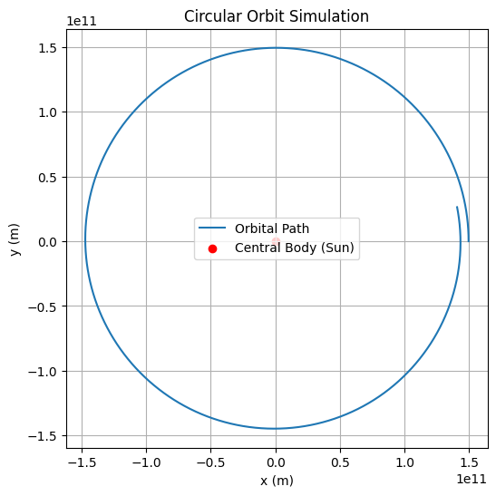
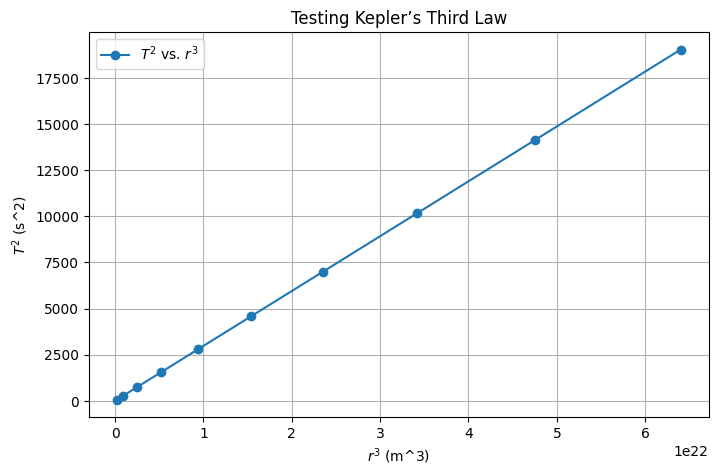
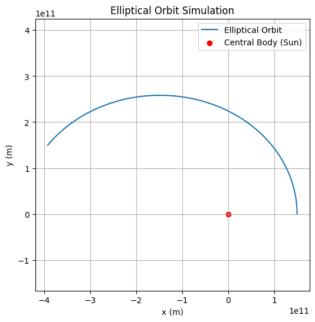

# Orbital Period and Orbital Radius: Kepler's Third Law

## Motivation  

The relationship between the square of the orbital period and the cube of the orbital radius, known as **Kepler's Third Law**, is a cornerstone of celestial mechanics. This law allows for the determination of planetary motions and has broad implications for understanding gravitational interactions both on local and cosmic scales. By analyzing this relationship, we can connect fundamental principles of gravity with real-world phenomena such as satellite orbits and planetary systems.

## Task Overview  

The task involves deriving the relationship between the square of the orbital period and the cube of the orbital radius for circular orbits. We will explore the implications of this law in astronomy, investigate real-world examples, and implement a computational model to simulate circular orbits and verify this relationship.

---

## 1. Derivation of Kepler’s Third Law  

For a body in a circular orbit, the centripetal force required to keep the body moving in orbit is provided by the gravitational force. This is expressed as:

$$
F_{\text{centripetal}} = F_{\text{gravitational}}
$$

The centripetal force is given by:

$$
F_{\text{centripetal}} = \frac{m v^2}{r}
$$

where:

- $m$ is the mass of the orbiting body,
- $v$ is the orbital velocity,
- $r$ is the orbital radius.

The gravitational force is:

$$
F_{\text{gravitational}} = \frac{G M m}{r^2}
$$

where:

- $G$ is the gravitational constant,
- $M$ is the mass of the central body (e.g., the Sun),
- $r$ is the orbital radius.

By equating the two forces:

$$
\frac{m v^2}{r} = \frac{G M m}{r^2}
$$

Simplifying:

$$
v^2 = \frac{G M}{r}
$$

Now, the velocity is related to the orbital period $T$ by:

$$
v = \frac{2\pi r}{T}
$$

Substituting this into the above equation:

$$
\left(\frac{2\pi r}{T}\right)^2 = \frac{G M}{r}
$$

Simplifying further:

$$
\frac{4\pi^2 r^2}{T^2} = \frac{G M}{r}
$$

Now, solve for $T^2$:

$$
T^2 = \frac{4\pi^2 r^3}{G M}
$$

This is the relationship between the orbital period squared ($T^2$) and the orbital radius cubed ($r^3$), which is Kepler's Third Law:

$$
T^2 \propto r^3
$$

---

## 2. Implications of Kepler's Third Law  

Kepler’s Third Law provides several important insights into the motion of celestial bodies:

- **Planetary Masses**: By measuring the orbital period and radius of a satellite or planet, the mass of the central body (e.g., the Sun or Earth) can be determined.
- **Orbital Distances**: The law helps calculate the distance of a planet or moon from the central star or planet based on its orbital period.
- **Satellite Orbits**: Kepler’s Third Law is used extensively in satellite communication and space exploration, determining satellite orbital periods for given altitudes.

### Real-World Example: The Moon’s Orbit Around Earth  

The Moon orbits Earth at an average distance of $r = 3.84 \times 10^8$ meters and has an orbital period of approximately $T = 27.3$ days. Using Kepler's Third Law:

$$
T^2 = \frac{4\pi^2 r^3}{G M}
$$

Substituting the values for $r$ and $M$ (the mass of Earth):

$$
T = \sqrt{\frac{4\pi^2 (3.84 \times 10^8)^3}{(6.67430 \times 10^{-11}) (5.972 \times 10^{24})}}
$$

This confirms that Kepler's Third Law can be used to accurately predict the Moon's orbital period.

---

## 3. Computational Model to Simulate Circular Orbits  

Below is a Python script to simulate the motion of a planet in a circular orbit using Newtonian mechanics. This simulation will help visualize the orbital motion and verify Kepler's Third Law.

### Code 1: Simulating a Circular Orbit Using Numerical Integration  

## 4. Testing  Kepler’s Third Law

We can now test the proportionality $T^2 \propto r^3$ numerically.

## 5. Extension to Elliptical Orbits  

For elliptical orbits, **Kepler’s Third Law** still holds, but we replace the orbital radius $r$ with the **semi-major axis** $a$:

$$
T^2 = \frac{4\pi^2}{G M} a^3
$$

This is the general form of Kepler’s Third Law for elliptical orbits, and it allows us to calculate the orbital period of objects in elliptical orbits, such as the planets in the Solar System.

---

### Code 3: Simulating an Elliptical Orbit

