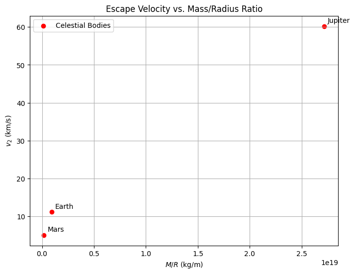

# Escape Velocities and Cosmic Velocities

## Motivation

The concept of escape velocity is fundamental to understanding how objects can break free from a celestial body's gravitational pull. Building on this, the first, second, and third cosmic velocities provide critical thresholds for orbiting a planet, escaping its gravity, and departing its star system, respectively. These velocities are essential for space exploration, governing satellite launches, interplanetary missions, and the theoretical framework for interstellar travel.

---

## Definitions and Physical Meaning

1. **First Cosmic Velocity ($v_1$)**:  

   The minimum speed required for an object to achieve a stable circular orbit around a celestial body at its surface. It is essentially the orbital velocity at radius $r = R$, where $R$ is the body's radius.

2. **Second Cosmic Velocity ($v_2$)**:  

   Known as the escape velocity, this is the minimum speed needed to escape a celestial body’s gravitational field from its surface, reaching infinity with zero residual velocity.

3. **Third Cosmic Velocity ($v_3$)**:  

   The minimum speed required to escape the gravitational influence of a star system (e.g., the Solar System) from a planet’s surface, assuming the planet is in a circular orbit around the star.

---

## Mathematical Derivations

### First Cosmic Velocity ($v_1$)

The first cosmic velocity is derived from the condition for circular orbit, where gravitational force equals centripetal force: $G M m / r^2 = m v^2 / r$. At the surface, $r = R$:

$$
G M / R^2 = v_1^2 / R
$$

Multiply by $R$:

$$
v_1^2 = G M / R
$$

Thus:

$$
v_1 = \sqrt{G M / R}
$$

where $G$ is the gravitational constant, $M$ is the mass of the celestial body, and $R$ is its radius.

### Second Cosmic Velocity ($v_2$)

The escape velocity is derived from conservation of energy. Total mechanical energy at the surface (kinetic + potential) must be zero at infinity:

$$
\frac{1}{2} m v_2^2 - G M m / R = 0
$$

Simplify:

$$
\frac{1}{2} v_2^2 = G M / R
$$

$$
v_2^2 = 2 G M / R
$$

Thus:

$$
v_2 = \sqrt{2 G M / R}
$$

Note that $v_2 = \sqrt{2} v_1$, meaning escape velocity is $\sqrt{2}$ times the orbital velocity.

### Third Cosmic Velocity ($v_3$)

The third cosmic velocity is more complex, as it involves escaping the star’s gravitational field from a planet’s surface. For a planet in a circular orbit around a star (mass $M_s$, orbital radius $a$), the planet’s orbital velocity is $v_p = \sqrt{G M_s / a}$. The total velocity to escape the Solar System from the planet’s surface combines:

- Escaping the planet: $v_2 = \sqrt{2 G M / R}$.
- Matching the planet’s orbital velocity and exceeding the star’s escape velocity at $a$.

The escape velocity from the star’s field at distance $a$ is:

$$
v_{\text{esc, star}} = \sqrt{2 G M_s / a}
$$

Assuming the launch is in the direction of the planet’s orbit, the approximate $v_3$ from the surface is:

$$
v_3 \approx \sqrt{v_2^2 + (v_{\text{esc, star}} - v_p)^2}
$$

For Earth escaping the Sun:

$$
v_3 \approx \sqrt{(11.2)^2 + (42.1 - 29.8)^2} \, \text{km/s}
$$

---

## Parameters Affecting These Velocities

- **Mass ($M$)**: Higher mass increases all velocities ($v_1$, $v_2$, $v_3$).
- **Radius ($R$)**: Larger radius decreases $v_1$ and $v_2$ (inverse relationship).
- **Star’s Mass ($M_s$) and Orbital Distance ($a$)**: For $v_3$, a more massive star or smaller orbit increases the velocity needed to escape the system.

---

## Calculations for Celestial Bodies

### Earth

- $M = 5.972 \times 10^{24}$ kg
- $R = 6.371 \times 10^6$ m
- $G = 6.6743 \times 10^{-11}$ m³ kg⁻¹ s⁻²
- $M_s = 1.989 \times 10^{30}$ kg (Sun’s mass)
- $a = 1.496 \times 10^{11}$ m (1 AU)

$$
v_1 = \sqrt{G M / R} = \sqrt{(6.6743 \times 10^{-11}) (5.972 \times 10^{24}) / (6.371 \times 10^6)} \approx 7.91 \, \text{km/s}
$$

$$
v_2 = \sqrt{2 G M / R} = \sqrt{2} \cdot 7.91 \approx 11.19 \, \text{km/s}
$$

$$
v_3 \approx \sqrt{(11.19)^2 + (42.1 - 29.8)^2} \approx 16.6 \, \text{km/s}
$$

### Mars

- $M = 6.417 \times 10^{23}$ kg
- $R = 3.39 \times 10^6$ m

$$
v_1 = \sqrt{(6.6743 \times 10^{-11}) (6.417 \times 10^{23}) / (3.39 \times 10^6)} \approx 3.55 \, \text{km/s}
$$

$$
v_2 = \sqrt{2} \cdot 3.55 \approx 5.02 \, \text{km/s}
$$

### Jupiter

- $M = 1.899 \times 10^{27}$ kg
- $R = 6.991 \times 10^7$ m

$$
v_1 = \sqrt{(6.6743 \times 10^{-11}) (1.899 \times 10^{27}) / (6.991 \times 10^7)} \approx 42.6 \, \text{km/s}
$$

$$
v_2 = \sqrt{2} \cdot 42.6 \approx 60.2 \, \text{km/s}
$$

---

## Importance in Space Exploration

1. **Launching Satellites**: $v_1$ determines the speed for low Earth orbit (e.g., 7.91 km/s). Rockets must exceed this, typically reaching 8-10 km/s with altitude.
2. **Interplanetary Missions**: $v_2$ (11.19 km/s for Earth) is the threshold for missions to Mars or the Moon. Additional velocity from Earth’s motion aids efficiency.
3. **Interstellar Travel**: $v_3$ (16.6 km/s from Earth) sets the bar for escaping the Solar System, as achieved by Voyager 1 using gravitational assists.

---

## Python Scripts and Visualizations

### Python Script 1: Cosmic Velocities Bar Plot

## Python Script 2: Velocity vs. Mass/Radius Ratio

