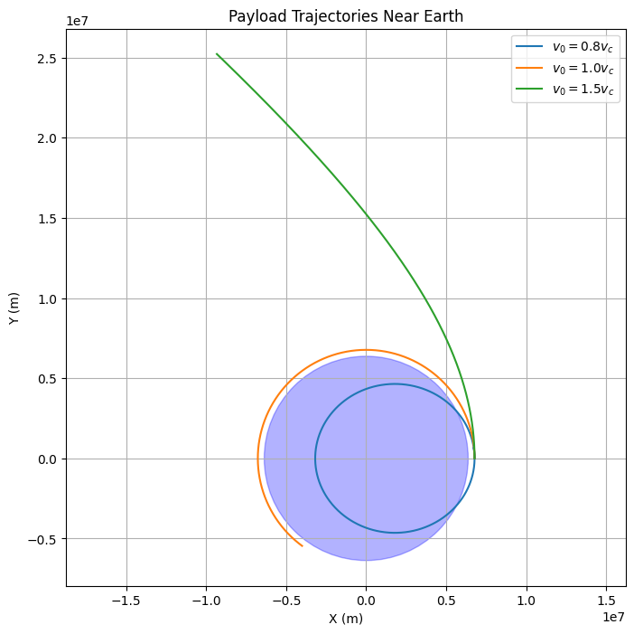
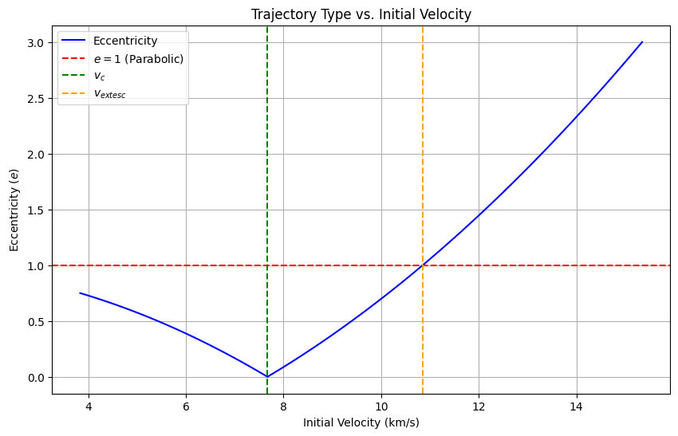

# Trajectories of a Freely Released Payload Near Earth

## Motivation

When a payload is released from a moving rocket near Earth, its subsequent trajectory is determined by its initial position, velocity, and Earth’s gravitational field. This scenario integrates orbital mechanics and numerical simulation, offering insights into payload deployment, orbital insertion, and reentry dynamics. Understanding these trajectories is critical for space mission planning, such as satellite launches or spacecraft reentry.

---

## Possible Trajectories

The trajectory of a freely released payload depends on its specific energy and angular momentum relative to Earth. Using gravitational principles, the possible paths are:

1. **Elliptical Trajectory**: If the payload’s total mechanical energy $E < 0$, it follows a bound, elliptical orbit around Earth.
2. **Parabolic Trajectory**: If $E = 0$, the payload escapes Earth with zero velocity at infinity, tracing a parabola.
3. **Hyperbolic Trajectory**: If $E > 0$, the payload escapes with excess velocity, following a hyperbola.

The specific energy per unit mass is:

$$
\epsilon = \frac{v^2}{2} - \frac{G M}{r}
$$

where $v$ is the initial velocity, $r$ is the radial distance from Earth’s center, $G$ is the gravitational constant, and $M$ is Earth’s mass. The trajectory type is determined by:

- $\epsilon < 0$: Elliptical
- $\epsilon = 0$: Parabolic
- $\epsilon > 0$: Hyperbolic

---

## Mathematical Derivation

### Equations of Motion

Newton’s Law of Gravitation provides the force: $F = G M m / r^2$. For a payload of mass $m$, the acceleration in polar coordinates (radial $r$, angular $\theta$) is:

$$
\ddot{r} - r \dot{\theta}^2 = -\frac{G M}{r^2}
$$

$$
r \ddot{\theta} + 2 \dot{r} \dot{\theta} = 0
$$

The second equation implies conservation of angular momentum: $h = r^2 \dot{\theta} = \text{constant}$.

### Trajectory Classification

The orbit’s shape is governed by the eccentricity $e$, derived from initial conditions:

$$
e = \sqrt{1 + \frac{2 \epsilon h^2}{(G M)^2}}
$$

- $e < 1$: Elliptical
- $e = 1$: Parabolic
- $e > 1$: Hyperbolic

For a circular orbit, $v = \sqrt{G M / r}$, and for escape, $v = \sqrt{2 G M / r}$.

---

## Numerical Analysis

To compute the trajectory, we solve the differential equations numerically using initial conditions: position $(r_0, \theta_0)$ and velocity $(v_{r0}, v_{\theta0})$. The state vector is $[r, \dot{r}, \theta, \dot{\theta}]$, and we use a numerical integrator (e.g., Runge-Kutta) to simulate the path under Earth’s gravity.

### Initial Conditions Example

- Altitude: 400 km ($r_0 = 6.371 \times 10^6 + 4 \times 10^5 = 6.771 \times 10^6$ m)
- Earth’s mass: $M = 5.972 \times 10^{24}$ kg
- $G = 6.6743 \times 10^{-11}$ m³ kg⁻¹ s⁻²
- Circular velocity: $v_{\theta0} = \sqrt{G M / r_0} \approx 7.67$ km/s
- Test cases: $v = 0.8 v_c$, $v_c$, $1.5 v_c$ (suborbital, orbital, escape)

---

## Relation to Space Scenarios

1. **Orbital Insertion**: If $v \approx v_c$, the payload enters an elliptical or circular orbit, useful for satellite deployment.
2. **Reentry**: If $v < v_c$, the trajectory intersects Earth’s surface or atmosphere, simulating a return path.
3. **Escape**: If $v > \sqrt{2 G M / r}$, the payload escapes Earth’s gravity, relevant for interplanetary missions.

---

## Python Scripts and Visualizations

### Python Script 1: Trajectory Simulation

## Python Script 2: Energy-Based Trajectory Types

