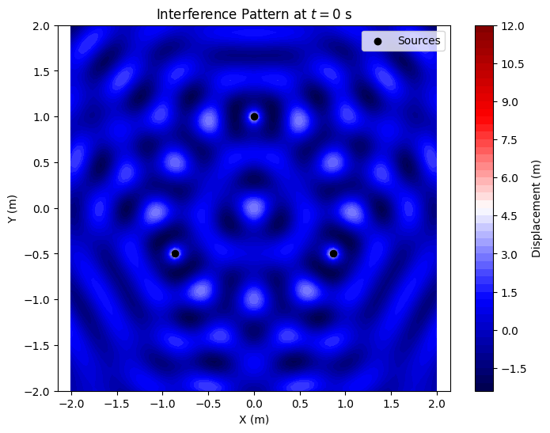
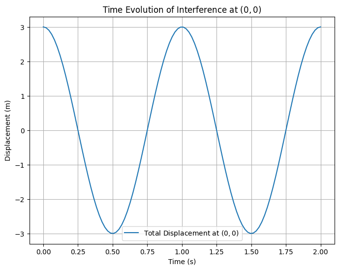

# Interference Patterns of Waves on a Water Surface

## Motivation

Interference occurs when waves from different sources overlap, creating new patterns on a water surface. Ripples from multiple points form distinctive interference patterns, demonstrating how waves can reinforce (constructive interference) or cancel (destructive interference) each other. This phenomenon provides a visual way to study wave behavior, phase relationships, and the effects of multiple sources. Understanding these patterns is fundamental to wave physics, with applications in acoustics, optics, and fluid dynamics.

---

## Problem Statement

The task is to analyze the interference patterns formed on a water surface due to the superposition of waves emitted from point sources placed at the vertices of a chosen regular polygon. A single wave from a source at $(x_0, y_0)$ is described by:

$$
\eta(x, y, t) = \frac{A}{\sqrt{r}} \cdot \cos(kr - \omega t + \phi)
$$

where:

- $\eta(x, y, t)$ is the displacement of the water surface at point $(x, y)$ and time $t$,
- $A$ is the amplitude,
- $k = 2\pi / \lambda$ is the wave number, with wavelength $\lambda$,
- $\omega = 2\pi f$ is the angular frequency, with frequency $f$,
- $r = \sqrt{(x - x_0)^2 + (y - y_0)^2}$ is the distance from the source to $(x, y)$,
- $\phi$ is the initial phase.

The total displacement from $N$ sources (vertices of the polygon) is given by the principle of superposition:

$$
\eta_{\text{sum}}(x, y, t) = \sum_{i=1}^N \eta_i(x, y, t)
$$

We assume all sources emit waves with the same $A$, $\lambda$, $f$, and a constant phase difference (set $\phi = 0$ for simplicity).

---

## Step-by-Step Analysis

### 1. Select a Regular Polygon

Let’s choose an equilateral triangle as the regular polygon, with vertices at $(x_i, y_i)$ for $i = 1, 2, 3$. Place the triangle centered at the origin with side length $s = 2$ m:

- Vertex 1: $(0, 1)$
- Vertex 2: $(\sqrt{3}/2, -1/2)$
- Vertex 3: $(-\sqrt{3}/2, -1/2)$

### 2. Position the Sources

The wave sources are placed at these vertices, so $(x_1, y_1) = (0, 1)$, $(x_2, y_2) = (\sqrt{3}/2, -1/2)$, and $(x_3, y_3) = (-\sqrt{3}/2, -1/2)$.

### 3. Wave Equations

For each source $i$, the wave equation is:

$$
\eta_i(x, y, t) = \frac{A}{\sqrt{r_i}} \cos(k r_i - \omega t)
$$

where $r_i = \sqrt{(x - x_i)^2 + (y - y_i)^2}$. We set $A = 1$ m, $\lambda = 0.5$ m, $f = 1$ Hz, so:

- $k = 2\pi / \lambda = 4\pi$ rad/m,
- $\omega = 2\pi f = 2\pi$ rad/s.

### 4. Superposition of Waves

The total displacement is:

$$
\eta_{\text{sum}}(x, y, t) = \sum_{i=1}^3 \frac{A}{\sqrt{r_i}} \cos(k r_i - \omega t)
$$

---

## Interference Patterns Analysis

### Constructive and Destructive Interference

- **Constructive Interference**: Occurs when waves are in phase, i.e., $|k(r_i - r_j)| = 2n\pi$ for integer $n$. The path difference $\Delta r = |r_i - r_j|$ must satisfy:

  $$
  \Delta r = n \lambda
  $$

- **Destructive Interference**: Occurs when waves are out of phase by $\pi$, i.e., $|k(r_i - r_j)| = (2n+1)\pi$, so:

  $$
  \Delta r = (n + 1/2) \lambda
  $$

For our setup, $\lambda = 0.5$ m, so constructive interference occurs at $\Delta r = 0, 0.5, 1, \ldots$ m, and destructive interference at $\Delta r = 0.25, 0.75, \ldots$ m.

### Time Evolution

At a fixed time $t$, the pattern depends on the spatial variation of $r_i$. As $t$ changes, the pattern oscillates with frequency $f$, creating a dynamic interference field.

---

## Python Scripts and Visualizations

## Python Script 2: Time Evolution of Displacement at a Point

