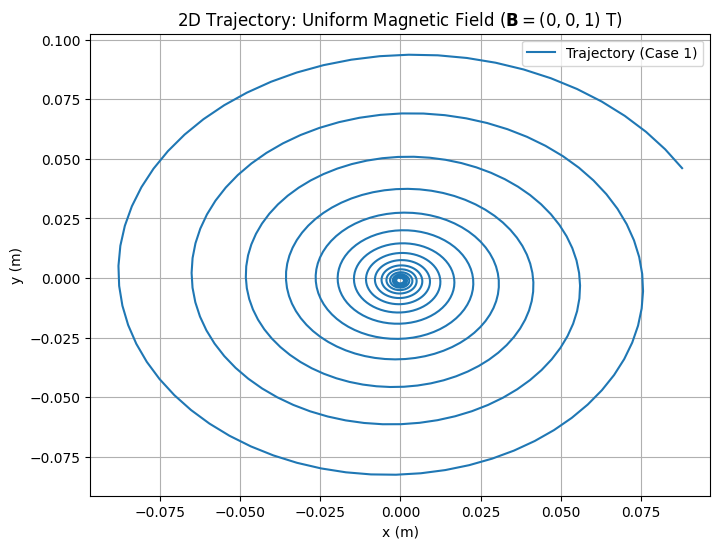
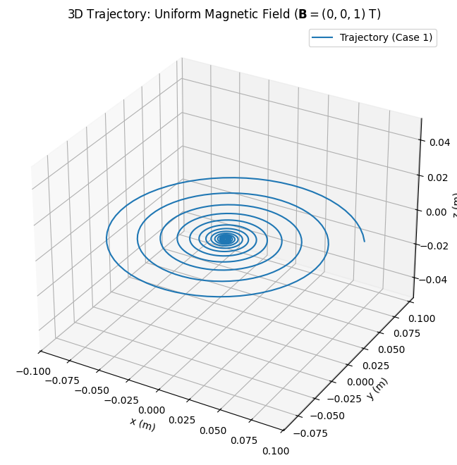
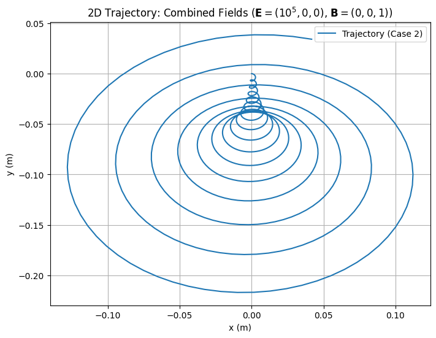
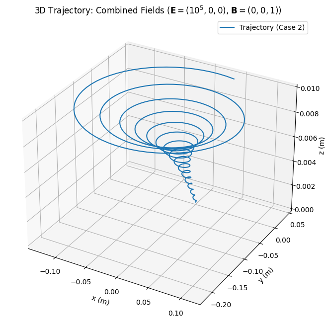
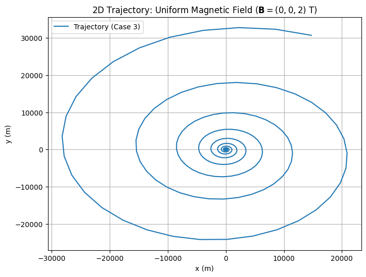
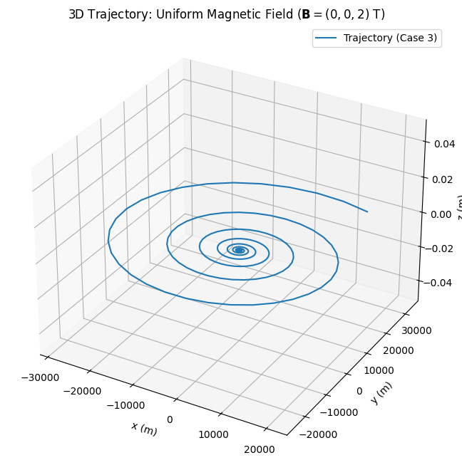

# Simulating the Effects of the Lorentz Force

## 1. Introduction and Motivation

The Lorentz force governs a charged particle's motion in electric and magnetic fields, given by:

$$
\mathbf{F}=q\mathbf{E}+q\mathbf{v}\times\mathbf{B}
$$

where:

- $\mathbf{F}$: force (N),
- $q$: charge (C),
- $\mathbf{E}$: electric field (V/m),
- $\mathbf{v}$: velocity (m/s),
- $\mathbf{B}$: magnetic field (T),
- $\times$: cross product.

The electric force is $\mathbf{F}_E=q\mathbf{E}$, and the magnetic force is $\mathbf{F}_B=q\mathbf{v}\times\mathbf{B}$, with magnitude $|\mathbf{F}_B|=|q|vB\sin\theta$, where $\theta$ is the angle between $\mathbf{v}$ and $\mathbf{B}$.

This project simulates a charged particle's motion under the Lorentz force, explores applications in particle accelerators and plasma confinement, and visualizes trajectories in 2D and 3D across uniform magnetic fields, combined fields, and crossed fields.

---

## 2. Applications

### 2.1 Systems Using the Lorentz Force

- **Particle Accelerators**: Cyclotrons use magnetic fields for circular motion, where centripetal force is:

$$
\frac{mv^2}{r}=|q|vB
$$

Thus, Larmor radius: $r=\frac{mv}{|q|B}$. Cyclotron frequency: $\omega=\frac{|q|B}{m}$, with period $T=\frac{2\pi}{\omega}=\frac{2\pi m}{|q|B}$.

- **Mass Spectrometers**: Ions are separated by mass-to-charge ratio, with radius $r=\frac{\sqrt{2mE_k}}{|q|B}$, where $E_k=\frac{1}{2}mv^2$.

- **Plasma Confinement**: Tokamaks confine particles via helical paths, with gyroradius $r_g=\frac{mv_\perp}{|q|B}$, where $v_\perp$ is perpendicular to $\mathbf{B}$.

- **Astrophysics**: Helical motion in Earth's magnetic field causes auroras, with pitch angle $\alpha=\tan^{-1}\left(\frac{v_\parallel}{v_\perp}\right)$.

### 2.2 Electric and Magnetic Field Roles

- **Electric Field ($\mathbf{E}$)**: Force $\mathbf{F}_E=q\mathbf{E}$, acceleration $\mathbf{a}_E=\frac{q}{m}\mathbf{E}$, causing linear motion along $\mathbf{E}$.

- **Magnetic Field ($\mathbf{B}$)**: Force $\mathbf{F}_B=q\mathbf{v}\times\mathbf{B}$, acceleration $\mathbf{a}_B=\frac{q}{m}(\mathbf{v}\times\mathbf{B})$, leading to circular/helical motion since $\mathbf{F}_B\perp\mathbf{v}$.

In crossed fields ($\mathbf{E}\perp\mathbf{B}$), drift velocity is $\mathbf{v}_d=\frac{\mathbf{E}\times\mathbf{B}}{B^2}$, with magnitude $v_d=\frac{E}{B}$.

---

## 3. Simulating Particle Motion

### 3.1 Equations of Motion

Newton's second law, $\mathbf{F}=m\mathbf{a}$, with $\mathbf{a}=\frac{d\mathbf{v}}{dt}$, gives:

$$
m\frac{d\mathbf{v}}{dt}=q\mathbf{E}+q\mathbf{v}\times\mathbf{B}
$$

Dividing by $m$:

$$
\frac{d\mathbf{v}}{dt}=\frac{q}{m}\mathbf{E}+\frac{q}{m}(\mathbf{v}\times\mathbf{B})
$$

Position updates: $\frac{d\mathbf{r}}{dt}=\mathbf{v}$. For $\mathbf{E}=(E_x,E_y,E_z)$, $\mathbf{B}=(B_x,B_y,B_z)$, the cross product is:

$$
\mathbf{v}\times\mathbf{B}=(v_yB_z-v_zB_y)\hat{i}-(v_xB_z-v_zB_x)\hat{j}+(v_xB_y-v_yB_x)\hat{k}
$$

Component equations:

$$
\frac{dv_x}{dt}=\frac{q}{m}E_x+\frac{q}{m}(v_yB_z-v_zB_y)
$$

$$
\frac{dv_y}{dt}=\frac{q}{m}E_y-\frac{q}{m}(v_xB_z-v_zB_x)
$$

$$
\frac{dv_z}{dt}=\frac{q}{m}E_z+\frac{q}{m}(v_xB_y-v_yB_x)
$$

Position: $\frac{dx}{dt}=v_x$, $\frac{dy}{dt}=v_y$, $\frac{dz}{dt}=v_z$.

### 3.2 Numerical Method: Euler Method

Using the Euler method with time step $\Delta t$:

$$
\mathbf{v}(t+\Delta t)=\mathbf{v}(t)+\left(\frac{q}{m}\mathbf{E}+\frac{q}{m}(\mathbf{v}\times\mathbf{B})\right)\Delta t
$$

$$
\mathbf{r}(t+\Delta t)=\mathbf{r}(t)+\mathbf{v}(t)\Delta t
$$

Components:

$$
v_x(t+\Delta t)=v_x(t)+\left(\frac{q}{m}E_x+\frac{q}{m}(v_yB_z-v_zB_y)\right)\Delta t
$$

$$
v_y(t+\Delta t)=v_y(t)+\left(\frac{q}{m}E_y-\frac{q}{m}(v_xB_z-v_zB_x)\right)\Delta t
$$

$$
v_z(t+\Delta t)=v_z(t)+\left(\frac{q}{m}E_z+\frac{q}{m}(v_xB_y-v_yB_x)\right)\Delta t
$$

$$
x(t+\Delta t)=x(t)+v_x(t)\Delta t
$$

$$
y(t+\Delta t)=y(t)+v_y(t)\Delta t
$$

$$
z(t+\Delta t)=z(t)+v_z(t)\Delta t
$$

### 3.3 Field Configurations

1. **Uniform Magnetic Field**: $\mathbf{B}=(0,0,B_z)$, $\mathbf{E}=0$. Cross product: $\mathbf{v}\times\mathbf{B}=(v_yB_z,-v_xB_z,0)$. Equations:

$$
\frac{dv_x}{dt}=\frac{qB_z}{m}v_y,\quad\frac{dv_y}{dt}=-\frac{qB_z}{m}v_x,\quad\frac{dv_z}{dt}=0
$$

Radius: $r=\frac{m\sqrt{v_x^2+v_y^2}}{|q|B_z}$.

2. **Combined Fields**: $\mathbf{B}=(0,0,B_z)$, $\mathbf{E}=(E_x,0,0)$. Equations:

$$
\frac{dv_x}{dt}=\frac{q}{m}E_x+\frac{qB_z}{m}v_y,\quad\frac{dv_y}{dt}=-\frac{qB_z}{m}v_x,\quad\frac{dv_z}{dt}=0
$$

Drift: $v_{d,y}=\frac{E_x}{B_z}$.

3. **Crossed Fields**: $\mathbf{E}\perp\mathbf{B}$, drift: $\mathbf{v}_d=\frac{\mathbf{E}\times\mathbf{B}}{B^2}$.

---

## 4. Parameter Exploration

Vary these parameters:

- **Field Strengths**: $E$, $B$. Larmor radius: $r\propto\frac{1}{B}$. Drift: $v_d\propto E$.
- **Initial Velocity**: $\mathbf{v}_0=(v_x,v_y,v_z)$. Perpendicular velocity: $v_\perp=\sqrt{v_x^2+v_y^2}$. Parallel: $v_\parallel=v_z$.
- **Charge and Mass**: $q$, $m$. Cyclotron frequency: $\omega\propto\frac{q}{m}$. Larmor radius: $r\propto\frac{m}{q}$.

---

## 5. Visualization

2D and 3D plots highlight:

- **Larmor Radius**: $r=\frac{mv_\perp}{|q|B}$.
- **Drift Velocity**: $v_d=\frac{E}{B}$.
- **Helical Pitch**: $p=v_\parallel T=v_\parallel\frac{2\pi m}{|q|B}$.

---

## 6. Python Implementation

This script simulates the particle's motion using the Euler method across three cases.

### Case 1: Uniform Magnetic Field

- Cyclotron Frequency: $\omega = 9.58e+07$ rad/s
- Larmor Radius: $r = 1.04e-03$ m

### Case 2: Combined Electric and Magnetic Fields

- Drift Velocity: $\mathbf{v}_d = (0.00e+00, -1.00e+05, 0.00e+00)$ m/s

### Case 3: Parameter Exploration (Varying B)

- Cyclotron Frequency: $\omega = 1.92e+08$ rad/s
- Larmor Radius: $r = 5.22e-04$ m

### Explanation of the Code

The Python script simulates a charged particle's motion under the Lorentz force using the Euler method:

- **Acceleration Calculation**: The `lorentz_acceleration` function computes the acceleration:

$$
\frac{d\mathbf{v}}{dt}=\frac{q}{m}\mathbf{E}+\frac{q}{m}(\mathbf{v}\times\mathbf{B})
$$

It uses NumPy's `np.cross` to calculate the cross product $\mathbf{v}\times\mathbf{B}$.

- **Motion Simulation**: The `simulate_motion` function updates velocity and position iteratively:

$$
\mathbf{v}_{n+1}=\mathbf{v}_n+\left(\frac{d\mathbf{v}}{dt}\right)\Delta t
$$

$$
\mathbf{r}_{n+1}=\mathbf{r}_n+\mathbf{v}_n\Delta t
$$

It stores $\mathbf{r}=(x,y,z)$ and $\mathbf{v}=(v_x,v_y,v_z)$ for plotting.

- **Theoretical Metrics**: The `compute_theoretical_values` function calculates:

$$
\omega=\frac{|q|B}{m},\quad r=\frac{mv_\perp}{|q|B}
$$

where $v_\perp=\sqrt{v_x^2+v_y^2}$, providing validation metrics.

- **Drift Velocity**: The `compute_drift_velocity` function computes:

$$
\mathbf{v}_d=\frac{\mathbf{E}\times\mathbf{B}}{B^2}
$$

with $B=\sqrt{B_x^2+B_y^2+B_z^2}$.

- **Visualization**: The `plot_trajectory` function generates 2D (x-y) and 3D plots to show the particle's path.

- **Cases**:
  1. Uniform $\mathbf{B}=(0,0,1)$ T, $\mathbf{E}=0$: Circular motion in x-y plane.
  2. Combined $\mathbf{E}=(10^5,0,0)$ V/m, $\mathbf{B}=(0,0,1)$ T: Helical path with drift $v_{d,y}=\frac{E_x}{B_z}$.
  3. Increased $\mathbf{B}=(0,0,2)$ T: Smaller radius, as $r\propto\frac{1}{B}$.

The script uses NumPy for calculations and Matplotlib for plotting.

---

## 7. Analysis: Practical Applications

### 7.1 Cyclotrons

Cyclotrons accelerate particles using magnetic fields for circular motion. The centripetal force is:

$$
\frac{mv^2}{r}=|q|vB
$$

So, radius $r=\frac{mv}{|q|B}$, and frequency $\omega=\frac{|q|B}{m}$. Case 1 shows this circular path. The particle's energy increases as $E_k=\frac{1}{2}mv^2$.

### 7.2 Plasma Confinement

In fusion devices like tokamaks, helical motion (Case 2) confines plasma. The helical pitch is:

$$
p=v_\parallel\frac{2\pi m}{|q|B}
$$

The gyroradius $r_g=\frac{mv_\perp}{|q|B}$ determines confinement; a stronger $B$ reduces $r_g$.

### 7.3 Magnetrons

Magnetrons in microwave ovens use crossed fields. Case 2 shows drift:

$$
\mathbf{v}_d=\frac{\mathbf{E}\times\mathbf{B}}{B^2}
$$

Electrons follow cycloidal paths, generating microwaves.

---

## 8. Future Enhancements

1. **Non-Uniform Fields**: Model $\mathbf{B}(z)=(0,0,B_0+kz)$ for mirroring, with force $F_z=-\mu\frac{\partial B}{\partial z}$, where $\mu=\frac{mv_\perp^2}{2B}$.
2. **Relativistic Effects**: Use $\mathbf{p}=\gamma m\mathbf{v}$, $\gamma=\frac{1}{\sqrt{1-\frac{v^2}{c^2}}}$, so $\frac{d\mathbf{p}}{dt}=q\mathbf{E}+q\mathbf{v}\times\mathbf{B}$.
3. **Collisions**: Add damping: $\frac{d\mathbf{v}}{dt}=\frac{q}{m}\mathbf{E}+\frac{q}{m}(\mathbf{v}\times\mathbf{B})-\nu\mathbf{v}$.
4. **Multiple Particles**: Study plasma oscillations with $\omega_p=\sqrt{\frac{nq^2}{\epsilon_0 m}}$.

---

## 9. Conclusion

The simulation modeled circular, helical, and drift motion under the Lorentz force, aligning with theory: $\omega=\frac{|q|B}{m}$, $r=\frac{mv_\perp}{|q|B}$, $\mathbf{v}_d=\frac{\mathbf{E}\times\mathbf{B}}{B^2}$. Case 3 confirms $r\propto\frac{1}{B}$. Results apply to cyclotrons (circular motion), plasma confinement (helical paths), and magnetrons (drift). Future work could include non-uniform fields, relativistic effects, and particle interactions for more complex scenarios.