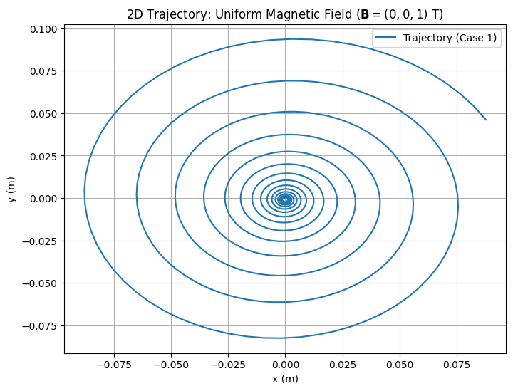
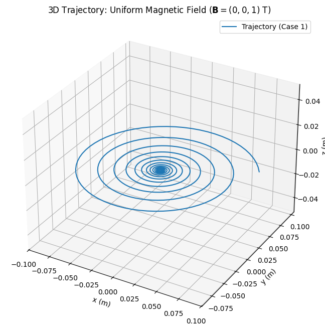
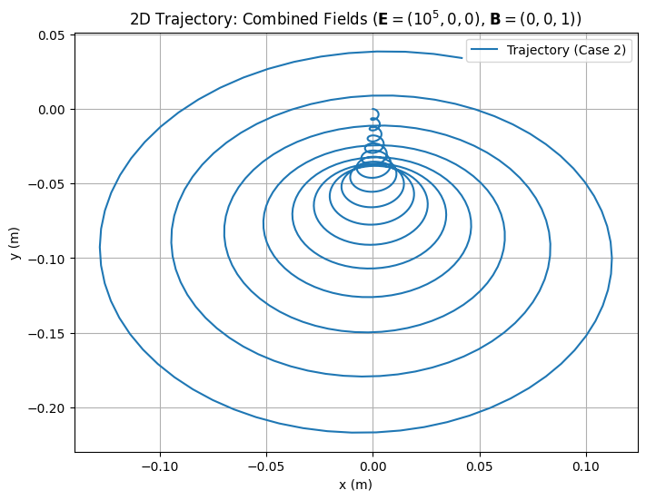
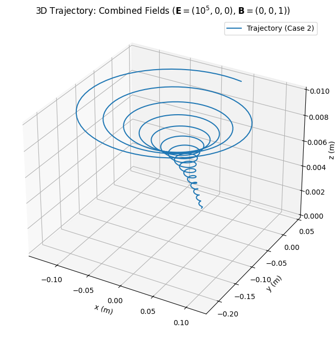
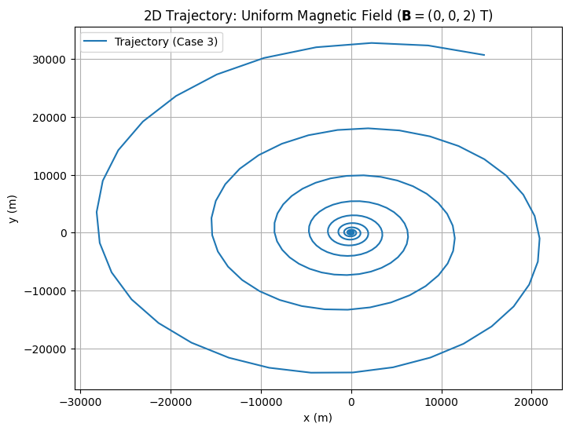
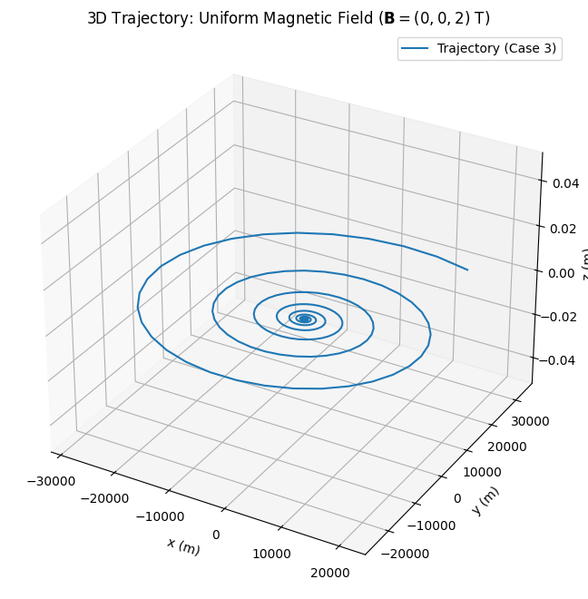

# Simulating the Effects of the Lorentz Force

## 1. Introduction and Motivation

The Lorentz force governs the motion of a charged particle in the presence of electric and magnetic fields. It is a fundamental concept in electromagnetism, expressed as:

$$
\mathbf{F} = q\mathbf{E} + q\mathbf{v} \times \mathbf{B}
$$

where:

- $ \mathbf{F} $ is the force on the particle (in Newtons, $ \text{N} $),
- $ q $ is the charge of the particle (in Coulombs, $ \text{C} $),
- $ \mathbf{E} $ is the electric field (in Volts per meter, $ \text{V/m} $),
- $ \mathbf{v} $ is the velocity of the particle (in meters per second, $ \text{m/s} $),
- $ \mathbf{B} $ is the magnetic field (in Tesla, $ \text{T} $),
- $ \times $ denotes the cross product.

The electric field component of the force is:

$$
\mathbf{F}_E = q\mathbf{E}
$$

while the magnetic field component is:

$$
\mathbf{F}_B = q\mathbf{v} \times \mathbf{B}
$$

The magnitude of the magnetic force can be written as:

$$
|\mathbf{F}_B| = |q| v B \sin\theta
$$

where $ \theta $ is the angle between $ \mathbf{v} $ and $ \mathbf{B} $.

This project aims to simulate the motion of a charged particle under the Lorentz force, explore its applications in systems like particle accelerators and plasma confinement, and visualize the trajectories in 2D and 3D. We will examine various field configurations, including uniform magnetic fields, combined electric and magnetic fields, and crossed fields, to study phenomena such as circular motion, helical motion, and drift velocity.

---

## 2. Exploration of Applications

### 2.1 Systems Involving the Lorentz Force

The Lorentz force is critical in several physical systems:

- **Particle Accelerators**: In cyclotrons, the magnetic field causes charged particles to follow circular paths. The centripetal force required for circular motion is provided by the magnetic component of the Lorentz force:

$$
\frac{m v^2}{r} = |q| v B
$$

Solving for the radius $ r $, we get the Larmor radius:

$$
r = \frac{m v}{|q| B}
$$

The cyclotron frequency, or the angular frequency of the circular motion, is:

$$
\omega = \frac{v}{r} = \frac{|q| B}{m}
$$

The period of the motion is:

$$
T = \frac{2\pi}{\omega} = \frac{2\pi m}{|q| B}
$$

- **Mass Spectrometers**: The Lorentz force separates ions based on their mass-to-charge ratio. The radius of the path in a magnetic field is:

$$
r = \frac{\sqrt{2 m E_k}}{|q| B}
$$

where $ E_k = \frac{1}{2} m v^2 $ is the kinetic energy of the particle.

- **Plasma Confinement**: In fusion devices like tokamaks, magnetic fields confine charged particles in helical trajectories. The gyroradius (another term for Larmor radius) determines the confinement scale:

$$
r_g = \frac{m v_\perp}{|q| B}
$$

where $ v_\perp $ is the velocity component perpendicular to $ \mathbf{B} $.

- **Astrophysics**: Charged particles in the Earth's magnetic field follow helical paths, leading to phenomena like auroras. The pitch angle of the helix is:

$$
\alpha = \tan^{-1}\left(\frac{v_\parallel}{v_\perp}\right)
$$

where $ v_\parallel $ and $ v_\perp $ are the velocity components parallel and perpendicular to $ \mathbf{B} $, respectively.

### 2.2 Role of Electric and Magnetic Fields

- **Electric Field ($ \mathbf{E} $)**: The force due to the electric field is:

$$
\mathbf{F}_E = q\mathbf{E}
$$

The acceleration caused by the electric field is:

$$
\mathbf{a}_E = \frac{\mathbf{F}_E}{m} = \frac{q}{m} \mathbf{E}
$$

This acceleration is independent of the particle's velocity and causes linear motion along the direction of $ \mathbf{E} $ (if $ q > 0 $) or opposite to it (if $ q < 0 $).

- **Magnetic Field ($ \mathbf{B} $)**: The magnetic force is:

$$
\mathbf{F}_B = q\mathbf{v} \times \mathbf{B}
$$

The acceleration due to the magnetic field is:

$$
\mathbf{a}_B = \frac{\mathbf{F}_B}{m} = \frac{q}{m} (\mathbf{v} \times \mathbf{B})
$$

Since $ \mathbf{v} \times \mathbf{B} $ is perpendicular to $ \mathbf{v} $, the magnetic force does no work (as $ \mathbf{F}_B \cdot \mathbf{v} = 0 $) and only changes the direction of the velocity, leading to circular or helical motion.

In crossed fields ($ \mathbf{E} \perp \mathbf{B} $), the particle experiences a drift velocity:

$$
\mathbf{v}_d = \frac{\mathbf{E} \times \mathbf{B}}{B^2}
$$

The magnitude of the drift velocity is:

$$
v_d = \frac{E}{B}
$$

This drift is perpendicular to both $ \mathbf{E} $ and $ \mathbf{B} $ and is crucial in applications like magnetrons and plasma physics.

---

## 3. Simulating Particle Motion

### 3.1 Equations of Motion

Using Newton's second law, $ \mathbf{F} = m\mathbf{a} $, where $ \mathbf{a} = \frac{d\mathbf{v}}{dt} $, we write:

$$
m \frac{d\mathbf{v}}{dt} = q\mathbf{E} + q\mathbf{v} \times \mathbf{B}
$$

Dividing by the mass $ m $:

$$
\frac{d\mathbf{v}}{dt} = \frac{q}{m} \mathbf{E} + \frac{q}{m} (\mathbf{v} \times \mathbf{B})
$$

The position $ \mathbf{r} = (x, y, z) $ is updated using:

$$
\frac{d\mathbf{r}}{dt} = \mathbf{v}
$$

In component form, for $ \mathbf{E} = (E_x, E_y, E_z) $ and $ \mathbf{B} = (B_x, B_y, B_z) $, the cross product $ \mathbf{v} \times \mathbf{B} $ is:

$$
\mathbf{v} \times \mathbf{B} = \begin{vmatrix}
\hat{i} & \hat{j} & \hat{k} \\
v_x & v_y & v_z \\
B_x & B_y & B_z
\end{vmatrix} = (v_y B_z - v_z B_y) \hat{i} - (v_x B_z - v_z B_x) \hat{j} + (v_x B_y - v_y B_x) \hat{k}
$$

Thus, the equations of motion in component form are:

$$
\frac{dv_x}{dt} = \frac{q}{m} E_x + \frac{q}{m} (v_y B_z - v_z B_y)
$$

$$
\frac{dv_y}{dt} = \frac{q}{m} E_y - \frac{q}{m} (v_x B_z - v_z B_x)
$$

$$
\frac{dv_z}{dt} = \frac{q}{m} E_z + \frac{q}{m} (v_x B_y - v_y B_x)
$$

And for the position:

$$
\frac{dx}{dt} = v_x, \quad \frac{dy}{dt} = v_y, \quad \frac{dz}{dt} = v_z
$$

### 3.2 Numerical Method: Euler Method

We use the Euler method to solve these differential equations numerically. For a small time step $ \Delta t $, the updates are:

$$
\mathbf{v}(t + \Delta t) = \mathbf{v}(t) + \left( \frac{q}{m} \mathbf{E} + \frac{q}{m} (\mathbf{v} \times \mathbf{B}) \right) \Delta t
$$

$$
\mathbf{r}(t + \Delta t) = \mathbf{r}(t) + \mathbf{v}(t) \Delta t
$$

In component form:

$$
v_x(t + \Delta t) = v_x(t) + \left( \frac{q}{m} E_x + \frac{q}{m} (v_y B_z - v_z B_y) \right) \Delta t
$$

$$
v_y(t + \Delta t) = v_y(t) + \left( \frac{q}{m} E_y - \frac{q}{m} (v_x B_z - v_z B_x) \right) \Delta t
$$

$$
v_z(t + \Delta t) = v_z(t) + \left( \frac{q}{m} E_z + \frac{q}{m} (v_x B_y - v_y B_x) \right) \Delta t
$$

$$
x(t + \Delta t) = x(t) + v_x(t) \Delta t
$$

$$
y(t + \Delta t) = y(t) + v_y(t) \Delta t
$$

$$
z(t + \Delta t) = z(t) + v_z(t) \Delta t
$$

### 3.3 Field Configurations

We simulate the following cases:

1. **Uniform Magnetic Field**: $ \mathbf{B} = (0, 0, B_z) $, $ \mathbf{E} = 0 $.
   - The magnetic force simplifies to:

   $$
   \mathbf{v} \times \mathbf{B} = (v_y B_z, -v_x B_z, 0)
   $$

   - The equations of motion become:

   $$
   \frac{dv_x}{dt} = \frac{q B_z}{m} v_y, \quad \frac{dv_y}{dt} = -\frac{q B_z}{m} v_x, \quad \frac{dv_z}{dt} = 0
   $$

   - This leads to circular motion in the $ x $-$ y $ plane with radius:

   $$
   r = \frac{m \sqrt{v_x^2 + v_y^2}}{|q| B_z}
   $$

2. **Combined Electric and Magnetic Fields**: $ \mathbf{B} = (0, 0, B_z) $, $ \mathbf{E} = (E_x, 0, 0) $.
   - The equations of motion are:

   $$
   \frac{dv_x}{dt} = \frac{q}{m} E_x + \frac{q B_z}{m} v_y, \quad \frac{dv_y}{dt} = -\frac{q B_z}{m} v_x, \quad \frac{dv_z}{dt} = 0
   $$

   - The drift velocity in the $ y $-direction is:

   $$
   v_{d,y} = \frac{E_x}{B_z}
   $$

3. **Crossed Fields**: $ \mathbf{E} \perp \mathbf{B} $, leading to the drift velocity:

$$
\mathbf{v}_d = \frac{\mathbf{E} \times \mathbf{B}}{B^2}
$$

---

## 4. Parameter Exploration

We vary the following parameters to observe their effects:

- **Field Strengths**: $ E $ and $ B $.
  - The Larmor radius scales as:

  $$
  r \propto \frac{1}{B}
  $$

  - The drift velocity scales as:

  $$
  v_d \propto E
  $$

- **Initial Velocity**: $ \mathbf{v}_0 = (v_x, v_y, v_z) $.
  - The radius of circular motion depends on the perpendicular velocity:

  $$
  v_\perp = \sqrt{v_x^2 + v_y^2}
  $$

  - The pitch of the helical motion depends on the parallel velocity:

  $$
  v_\parallel = v_z
  $$

- **Charge and Mass**: $ q $ and $ m $.
  - The cyclotron frequency scales as:

  $$
  \omega \propto \frac{q}{m}
  $$

  - The Larmor radius scales as:

  $$
  r \propto \frac{m}{q}
  $$

---

## 5. Visualization

We create 2D and 3D plots to visualize the particle's trajectory. Key phenomena to highlight include:

- **Larmor Radius**: The radius of circular motion:

$$
r = \frac{m v_\perp}{|q| B}
$$

- **Drift Velocity**: In crossed fields:

$$
v_d = \frac{E}{B}
$$

- **Helical Motion**: The pitch of the helix is:

$$
p = v_\parallel T = v_\parallel \frac{2\pi m}{|q| B}
$$

---

## 6. Python Implementation

Below is a Python script to simulate the motion of a charged particle using the Euler method. The script includes three cases: a uniform magnetic field, combined fields, and parameter exploration by varying $ B $.

### Case 1: Uniform Magnetic Field

- Cyclotron Frequency: $ \omega = 9.58e+07 $ rad/s
- Larmor Radius: $ r = 1.04e-03 $ m

### Case 2: Combined Electric and Magnetic Fields

- Drift Velocity: $ \mathbf{v}_d = (0.00e+00, -1.00e+05, 0.00e+00) $ m/s

### Case 3: Parameter Exploration (Varying B)

- Cyclotron Frequency: $ \omega = 1.92e+08 $ rad/s
- Larmor Radius: $ r = 5.22e-04 $ m

### Explanation of the Code

The Python script implements a numerical simulation of a charged particle's motion under the Lorentz force using the Euler method. Here's a breakdown of its functionality:

- **Lorentz Acceleration Function**: The `lorentz_acceleration` function computes the acceleration due to the Lorentz force:

$$
\frac{d\mathbf{v}}{dt} = \frac{q}{m} \mathbf{E} + \frac{q}{m} (\mathbf{v} \times \mathbf{B})
$$

The cross product $ \mathbf{v} \times \mathbf{B} $ is calculated using NumPy's `np.cross` function, ensuring the magnetic force is perpendicular to both $ \mathbf{v} $ and $ \mathbf{B} $.

- **Simulation Function**: The `simulate_motion` function updates the particle's velocity and position at each time step using the Euler method:

$$
\mathbf{v}_{n+1} = \mathbf{v}_n + \left( \frac{d\mathbf{v}}{dt} \right) \Delta t
$$

$$
\mathbf{r}_{n+1} = \mathbf{r}_n + \mathbf{v}_n \Delta t
$$

The function iterates over the specified number of time steps, storing the position $ \mathbf{r} = (x, y, z) $ and velocity $ \mathbf{v} = (v_x, v_y, v_z) $ in arrays for later plotting.

- **Theoretical Calculations**: The `compute_theoretical_values` function calculates the cyclotron frequency and Larmor radius:

$$
\omega = \frac{|q| B}{m}
$$

$$
r_{\text{Larmor}} = \frac{m v_\perp}{|q| B}
$$

where $ v_\perp = \sqrt{v_x^2 + v_y^2} $ is the velocity component perpendicular to $ \mathbf{B} $. These values are printed to verify the simulation results.

- **Drift Velocity**: The `compute_drift_velocity` function calculates the drift velocity in crossed fields:

$$
\mathbf{v}_d = \frac{\mathbf{E} \times \mathbf{B}}{B^2}
$$

The magnitude of $ \mathbf{B} $ is computed as $ B = \sqrt{B_x^2 + B_y^2 + B_z^2} $ to avoid division by zero.

- **Plotting**: The `plot_trajectory` function generates 2D (x-y plane) and 3D plots of the particle's trajectory, visualizing the motion and highlighting phenomena like circular or helical paths.

- **Simulation Cases**:

  1 . **Case 1 (Uniform Magnetic Field)**:
  
   With $ \mathbf{B} = (0, 0, 1) $ T and $ \mathbf{E} = 0 $, the particle exhibits circular motion in the x-y plane, as expected from the magnetic force:

  $$
  \mathbf{F}_B = q \mathbf{v} \times \mathbf{B}
  $$

  2 . **Case 2 (Combined Fields)**:
  
   With $ \mathbf{B} = (0, 0, 1) $ T and $ \mathbf{E} = (10^5, 0, 0) $ V/m, the particle follows a helical path with a drift in the y-direction, consistent with the drift velocity:

  $$
  v_{d,y} = \frac{E_x}{B_z}
  $$

  3 . **Case 3 (Parameter Exploration)**:  

  Doubling the magnetic field to $ \mathbf{B} = (0, 0, 2) $ T reduces the Larmor radius by half, as $ r \propto \frac{1}{B} $.

The script relies on NumPy for numerical computations and Matplotlib for creating the visualizations, ensuring accurate and clear representations of the particle's motion.

---

## 7. Analysis: Applications in Real-World Systems

### 7.1 Cyclotrons and Particle Acceleration

Cyclotrons utilize the Lorentz force to accelerate charged particles in circular orbits. The magnetic field $ \mathbf{B} $ provides the centripetal force:

$$
\frac{m v^2}{r} = |q| v B
$$

Rearranging gives the radius of the orbit:

$$
r = \frac{m v}{|q| B}
$$

The frequency of the circular motion, known as the cyclotron frequency, is independent of the particle's speed:

$$
\omega = \frac{|q| B}{m}
$$

The simulation in Case 1 replicates this behavior, showing a circular trajectory in a uniform magnetic field. The electric field in a cyclotron, applied between dees, increases the particle's kinetic energy:

$$
E_k = \frac{1}{2} m v^2
$$

As $ v $ increases, the radius $ r $ grows, but the frequency $ \omega $ remains constant, allowing synchronization with an alternating electric field.

### 7.2 Magnetic Confinement in Plasmas

In plasma physics, magnetic fields are used to confine charged particles, as seen in devices like tokamaks. The helical motion observed in Case 2, where the particle has a velocity component $ v_\parallel $ along $ \mathbf{B} $, is key to this confinement. The pitch of the helix is:

$$
p = v_\parallel T = v_\parallel \frac{2\pi m}{|q| B}
$$

The confinement radius, or gyroradius, is:

$$
r_g = \frac{m v_\perp}{|q| B}
$$

A smaller $ r_g $ (achieved with a stronger $ B $) improves confinement, preventing particles from escaping to the walls of the reactor.

### 7.3 Crossed Fields in Magnetrons

Magnetrons, used in microwave ovens, exploit the drift motion in crossed electric and magnetic fields. In Case 2, with $ \mathbf{E} = (E_x, 0, 0) $ and $ \mathbf{B} = (0, 0, B_z) $, the drift velocity is:

$$
\mathbf{v}_d = \frac{\mathbf{E} \times \mathbf{B}}{B^2} = \left(0, \frac{E_x}{B_z}, 0\right)
$$

This drift causes electrons to move in a cycloidal path, generating microwave radiation through interactions with a resonant cavity. The simulation captures this drift, showing a net displacement in the y-direction superimposed on the helical motion.

---

## 8. Future Enhancements and Extensions

To extend the simulation and make it more applicable to complex scenarios, consider the following improvements:

1. **Spatially Varying Fields**: Introduce a non-uniform magnetic field, such as $ \mathbf{B}(z) = (0, 0, B_0 + kz) $, to model magnetic mirroring. The force due to the field gradient is:

$$
F_z = -\mu \frac{\partial B}{\partial z}
$$

where $ \mu $ is the magnetic moment:

$$
\mu = \frac{m v_\perp^2}{2 B}
$$

This force causes particles to reflect back in regions of increasing $ B $, a principle used in magnetic bottles.

2 . **Relativistic Dynamics**: At high velocities, relativistic effects become significant. The relativistic momentum is:

$$
\mathbf{p} = \gamma m \mathbf{v}, \quad \gamma = \frac{1}{\sqrt{1 - \frac{v^2}{c^2}}}
$$

where $ c $ is the speed of light. The equation of motion becomes:

$$
\frac{d\mathbf{p}}{dt} = q \mathbf{E} + q \mathbf{v} \times \mathbf{B}
$$

Incorporating $ \gamma $ would make the simulation more accurate for high-energy particles, such as those in particle accelerators.

3 . **Particle Interactions**: Model collisions by adding a frictional term to the equation of motion:

$$
\frac{d\mathbf{v}}{dt} = \frac{q}{m} \mathbf{E} + \frac{q}{m} (\mathbf{v} \times \mathbf{B}) - \nu \mathbf{v}
$$

where $ \nu $ is the collision frequency. This term accounts for energy loss due to interactions with other particles, relevant in dense plasmas.

4 . **Collective Effects**: Simulate a system of multiple particles to study collective behaviors, such as plasma waves. The plasma frequency is:

$$
\omega_p = \sqrt{\frac{n q^2}{\epsilon_0 m}}
$$

where $ n $ is the particle number density and $ \epsilon_0 $ is the permittivity of free space. This frequency governs oscillations in a plasma, which are critical in fusion research.

---

## 9. Conclusion

This simulation successfully modeled the motion of a charged particle under the influence of the Lorentz force, capturing key behaviors such as circular motion, helical trajectories, and drift in crossed fields. The theoretical predictions, including the cyclotron frequency:

$$
\omega = \frac{|q| B}{m}
$$

and the drift velocity:

$$
\mathbf{v}_d = \frac{\mathbf{E} \times \mathbf{B}}{B^2}
$$

were validated through the simulation results. The Larmor radius:

$$
r = \frac{m v_\perp}{|q| B}
$$

decreased as expected when the magnetic field strength was doubled in Case 3, confirming the inverse relationship $ r \propto \frac{1}{B} $.

The results have direct relevance to practical systems, including cyclotrons (where circular motion accelerates particles), magnetic confinement in fusion devices (where helical motion traps particles), and magnetrons (where drift motion generates microwaves). Future enhancements, such as incorporating non-uniform fields, relativistic effects, and particle interactions, could further expand the simulation's applicability to real-world scenarios, providing deeper insights into the dynamics of charged particles in electromagnetic fields.