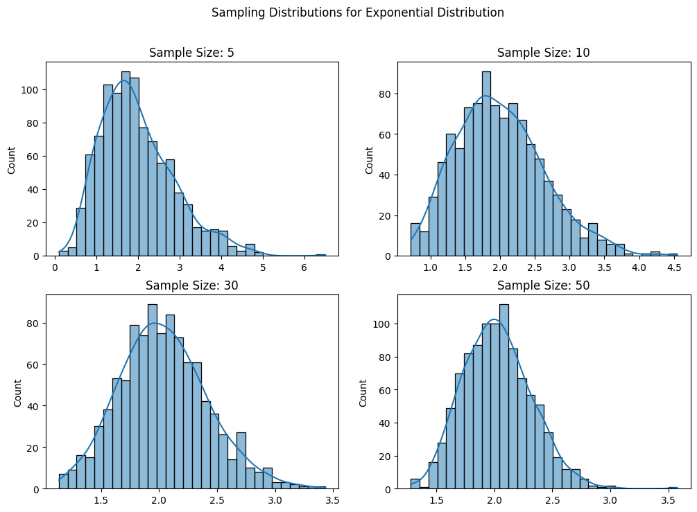

# Central Limit Theorem: A Simulation Approach

## Introduction

The **Central Limit Theorem (CLT)** is a fundamental theorem in probability and statistics. It states that, given a sufficiently large sample size, the sampling distribution of the sample mean will approximate a normal distribution, regardless of the shape of the population distribution. This theorem is crucial in inferential statistics, as it justifies the use of normal probability models for sample statistics.

Mathematically, if $X_1, X_2, ..., X_n$ are independent and identically distributed (i.i.d.) random variables with mean $\mu$ and variance $\sigma^2$, then the standardized sample mean:

$$
Z = \frac{\bar{X} - \mu}{\sigma / \sqrt{n}}
$$

approaches a standard normal distribution as $n \to \infty$.

## 1. Simulating Sampling Distributions

### Population Distributions

We consider three different types of population distributions:

1. **Uniform Distribution**: $X \sim U(a, b)$, meaning $X$ is equally likely to take any value between $a$ and $b$.
2. **Exponential Distribution**: $X \sim Exp(\lambda)$, which models waiting times between events occurring at a constant rate $\lambda$.
3. **Binomial Distribution**: $X \sim B(n, p)$, representing the number of successes in $n$ independent Bernoulli trials with success probability $p$.

For each distribution, we generate a large dataset representing the population to examine how the sample mean behaves.

## 2. Sampling and Visualization

### Steps:

- Randomly sample data from the population.
- Calculate the sample mean for different sample sizes ($n=5,10,30,50$).
- Repeat the process multiple times to create a sampling distribution of the sample mean.
- Plot histograms of the sample means for each sample size and observe the convergence to a normal distribution.

### Expected Behavior:

- As the sample size increases, the sampling distribution of the mean should become more symmetric and bell-shaped.
- Even for skewed distributions (e.g., exponential), the sampling distribution will still converge to normality.
- The standard deviation of the sampling distribution should shrink as sample size increases, given by:

  $$
  \sigma_{\bar{X}} = \frac{\sigma}{\sqrt{n}}
  $$

  where $\sigma_{\bar{X}}$ is the standard error of the mean.

### Python Implementation

## 3. Parameter Exploration

### Rate of Convergence

The rate at which the sampling distribution approaches normality depends on:

- **Shape of the original distribution**: Highly skewed distributions (e.g., exponential) require larger sample sizes to exhibit normality.
- **Sample size**: Larger sample sizes lead to faster convergence. Typically, for most practical purposes, $n \geq 30$ is sufficient.

Mathematically, the sampling distribution of the mean has the following properties:

1. **Mean**:

   $$
   \mathbb{E}[\bar{X}] = \mathbb{E}[X] = \mu
   $$

   meaning the expected value of the sample mean is equal to the population mean.
2. **Variance**:

   $$
   \text{Var}(\bar{X}) = \frac{\sigma^2}{n}
   $$

   meaning that increasing the sample size reduces variance.

### Impact of Variance

- Higher variance in the population results in a wider spread in the sampling distribution.
- Increasing the sample size reduces the standard error, making the sampling distribution more concentrated around the true mean.
- The standard deviation of the sample mean (standard error) is given by:

  $$
  SE = \frac{\sigma}{\sqrt{n}}
  $$

## 4. Practical Applications

The CLT is widely used in statistical inference, hypothesis testing, and real-world applications:

- **Estimating population parameters**: The sample mean provides an estimate of the population mean when the population is unknown.
- **Quality control**: In manufacturing, sample means help monitor production quality, ensuring product consistency.
- **Financial modeling**: Stock returns often follow non-normal distributions, but their sample means tend to be normally distributed, making risk estimation feasible.
- **Medical studies**: Drug efficacy studies often rely on CLT to determine the effectiveness of treatments using sample means.

## Conclusion

Through simulation, we demonstrated that regardless of the original distribution, the sampling distribution of the mean approaches normality as sample size increases. The results confirm theoretical expectations and highlight the importance of the CLT in statistics and real-world applications.

Key Takeaways:

- The CLT holds for a wide range of distributions.
- Larger sample sizes lead to faster convergence to normality.
- The standard error decreases as the sample size increases, making estimates more precise.

This exploration of the CLT underscores its significance in statistical inference and data analysis, providing a foundation for understanding sampling behavior and estimation techniques.

