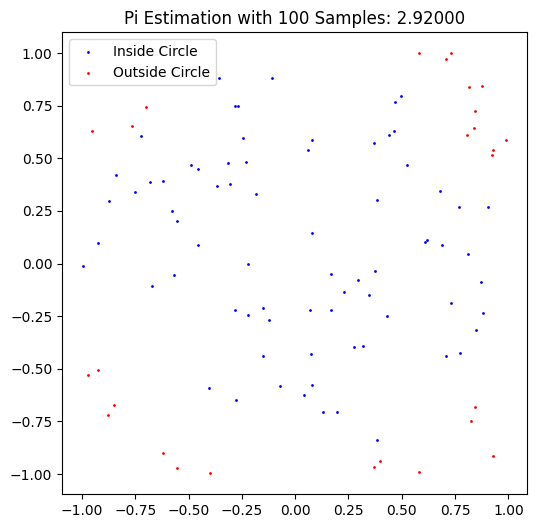
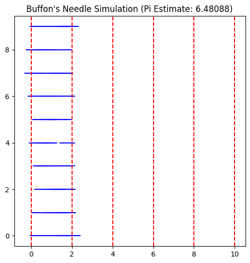

# Estimating Pi using Monte Carlo Methods

## Introduction

Monte Carlo methods are a class of computational algorithms that rely on repeated random sampling to estimate numerical results. One of the classic applications of Monte Carlo methods is estimating the value of $\pi$ through geometric probability. In this document, we explore two such approaches:

1. Using the ratio of points inside a unit circle to the total points in a square.
2. Buffon's Needle experiment, which estimates $\pi$ based on the probability of a needle crossing parallel lines.

## Part 1: Estimating $\pi$ Using a Circle

### Theoretical Foundation

The idea behind this method is simple: if we randomly distribute points within a square of side length 2, the proportion of points that fall inside an inscribed circle should approximate the ratio of their areas.

For a unit circle ($r=1$) inscribed in a square of side length 2:

- The area of the circle is: $ A_{circle} = \pi r^2 = \pi$.
- The area of the square is: $ A_{square} = 4$.

Since points are randomly distributed in the square, the probability of a point falling inside the circle is proportional to the ratio of their areas:

$$
\frac{\text{Points inside circle}}{\text{Total points}} \approx \frac{A_{circle}}{A_{square}} = \frac{\pi}{4}
$$

Solving for $\pi$:

$$
\pi \approx 4 \times \frac{\text{Points inside circle}}{\text{Total points}}
$$

### Simulation

We generate random points $(x, y)$ inside the square $[-1,1] \times [-1,1]$ and count how many fall inside the unit circle ($x^2 + y^2 \leq 1$). The ratio of these counts gives our estimate for $\pi$.

### Visualization

A scatter plot will show points inside the circle in one color and those outside in another, helping us visualize the method.

### Python Code

## Part 2: Estimating $\pi$ Using Buffon's Needle

### Theoretical Foundation

Buffon's Needle experiment estimates $\pi$ based on the probability of a randomly dropped needle crossing parallel lines. Given:

- Needle length $l$.
- Distance between parallel lines $d$ (where $l \leq d$).

The probability of a needle crossing a line is given by:

$$
P = \frac{2lN}{dX} \Rightarrow \pi \approx \frac{2lN}{dX}
$$

where:

- $N$ = total number of needle drops,
- $X$ = number of crossings.

### Simulation
We simulate randomly dropping needles onto a plane with parallel lines and count how often they cross a line.

### Visualization
A graphical representation will show needle positions, highlighting crossings.

### Python Code

## Analysis

### Convergence

Both methods improve in accuracy as the number of samples increases. We compare their convergence using graphs:

### Comparison

| Method | Accuracy | Computational Complexity |
|--------|----------|-------------------------|
| Circle-Based | High with large samples | Low complexity, fast |
| Buffon's Needle | Lower, slower convergence | More computationally expensive |

### Conclusion

- The circle-based Monte Carlo method is more efficient and converges faster.
- Buffon's Needle provides an interesting probabilistic approach but requires more samples for accuracy.
- Both methods demonstrate the power of Monte Carlo simulations in numerical estimation.

This study highlights how randomness can be harnessed to solve complex problems in probability, physics, and computational mathematics.

